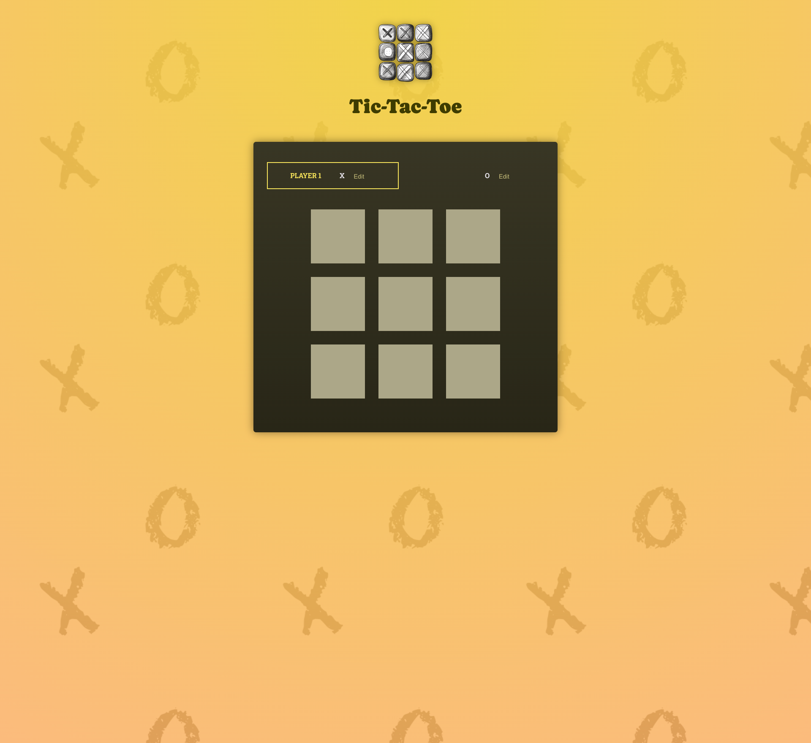
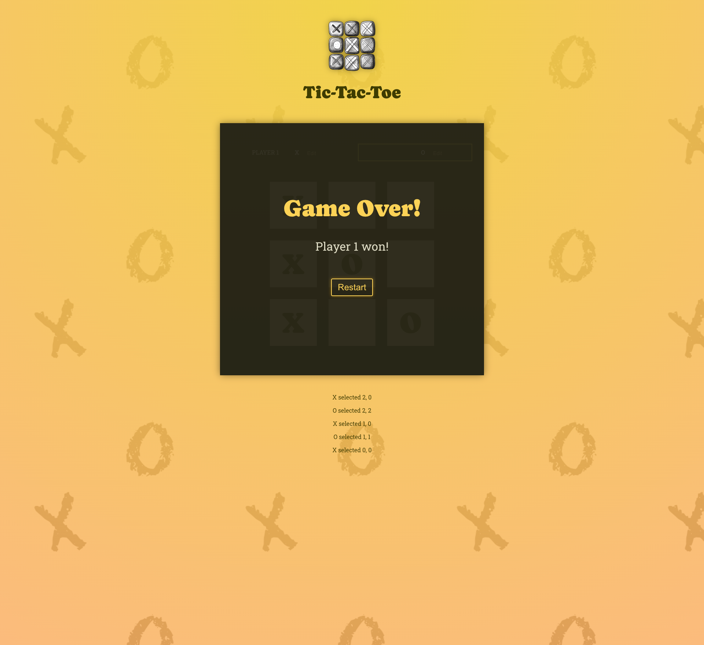
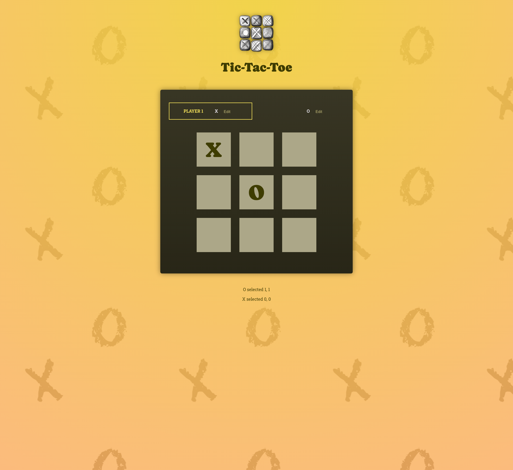

# 🎯 React Deep Dive – Essentials & Advanced Concepts  
[](https://eshrakrahman.netlify.app/)


This repository documents my continued journey learning **React**, moving from fundamentals to more advanced concepts.  
It begins by improving a demo application from a previous section and then evolves into a fully interactive **Tic-Tac-Toe game** built with React.  

👉 **Live on GitHub:** [EshrakRahman/tictactoe-react](https://github.com/EshrakRahman/tictactoe-react)

---

## 🧠 What I Explored
- **JSX & Non-JSX Alternatives** – Understanding how JSX compiles under the hood  
- **Component Structure** – Organizing and nesting components for scalability  
- **State Management** – Revisiting `useState` and applying advanced state techniques  
- **Patterns & Best Practices** – Cleaner, more maintainable code  
- **Project Refactoring** – Improving clarity and structure of existing code  

---

## 🧩 Projects Included
### 1. Improved Demo App  
- Refactored component hierarchy  
- Better prop and state handling  

### 2. Tic-Tac-Toe Game  
- Built entirely with React  
- Demonstrates lifted state, event handling, and conditional rendering  

---

## ⚙️ Tech Stack
- **React** (Vite / CRA)  
- **JavaScript (ES6+)**  
- **CSS Modules / Plain CSS**

---

## 🚀 Run Locally
```bash
# Clone the repository
git clone https://github.com/EshrakRahman/tictactoe-react.git

# Navigate to the project folder
cd tictactoe-react

# Install dependencies
npm install

# Start the development server
npm run dev
````

---

## 🖼️ Screenshots

### 🎮 Tic-Tac-Toe Game Interface



### 🧩 Component Tree Overview



### 💡 State Update Example




---

## ✍️ Reflection

This section deepened my understanding of how React really works — not just how to use it.
I learned to think in components, manage data flow through state and props, and structure a React project for clarity.

Building the Tic-Tac-Toe game was especially valuable for practicing interactive UI logic and exploring real-world React patterns.
It’s a small but meaningful step toward writing scalable, production-quality React code.

---

## 🔜 Next Steps

* Learn **React Context API** and **useReducer** for complex state management
* Explore **custom hooks** and **reusable UI components**
* Practice deploying React apps using **Vercel** or **Netlify**


